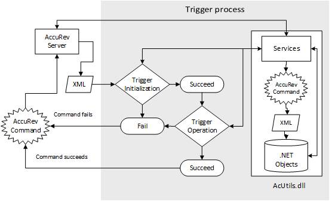

<!-- Copyright (C) 2016 Verizon. All Rights Reserved.

Licensed under the Apache License, Version 2.0 (the "License");
you may not use this file except in compliance with the License.
You may obtain a copy of the License at
    http://www.apache.org/licenses/LICENSE-2.0

Unless required by applicable law or agreed to in writing, software
distributed under the License is distributed on an "AS IS" BASIS,
WITHOUT WARRANTIES OR CONDITIONS OF ANY KIND, either express or implied.
See the License for the specific language governing permissions and
limitations under the License. -->

\htmlonly

\endhtmlonly 

AcUtils is a high performance abstraction layer to [AccuRev](http://www.borland.com/en-GB/Products/Change-Management/AccuRev). It's an open source library written in C#, developed at Verizon and available 
on https://github.com/Verizon. AcUtils expands AccuRev's core product offering by way of [XML](https://en.wikipedia.org/wiki/XML) and the [.NET Framework](http://www.microsoft.com/net). As a strongly named 
(tamper resistant) assembly (\c AcUtils.dll), AcUtils provides a secure high level API to 
[AccuRev CLI commands](https://supportline.microfocus.com/Documentation/books/AccuRev/AccuRev/6.2/webhelp/wwhelp/wwhimpl/js/html/wwhelp.htm#href=AccuRev_User_CLI/the_accurev_program.html) 
by [spawning their execution](@ref AcUtils#AcCommand) and converting the XML result into .NET objects. This allows the use of integrated development environments and programming languages with familiar constructs. 
AcUtils facilitates the development of ad hoc queries, custom applications, and pre/post operation triggers. It helps streamline administrative tasks and enables third-party integration.

Moreover, complex tasks can be simplified and in-depth analysis achieved using AcUtils and [LINQ to XML](https://msdn.microsoft.com/en-us/library/bb387098.aspx), where LINQ query syntax can replace traditional 
loops (e.g., \c for, \c while, \c do/while, etc.), thus moving program logic from an imperative model to a declarative one, for code that is more expressive, powerful, and maintainable. AcUtils also provides 
[phenomenal performance](@ref perfdemo) compared to traditional methods via [async programming](https://msdn.microsoft.com/en-us/library/hh191443.aspx) for background processing (responsive UIs) and concurrent code execution 
across multiple CPUs. Features include:

  - Object-oriented development using [depot](@ref AcUtils#AcDepots#AcDepots), [stream](@ref AcUtils#AcStreams#AcStreams), [workspace](@ref AcUtils#AcWorkspaces#AcWorkspaces), [group](@ref AcUtils#AcGroups#AcGroups), [user](@ref AcUtils#AcUsers#AcUsers), [property](@ref AcUtils#AcProperties#AcProperties), 
	[permission](@ref AcUtils#AcPermissions#AcPermissions), [rule](@ref AcUtils#AcRules#AcRules), [lock](@ref AcUtils#AcLocks#AcLocks), and [session](@ref AcUtils#AcSessions#AcSessions) classes among others.
  - As <a href="https://msdn.microsoft.com/en-us/library/12a7a7h3(v=vs.110).aspx">CLS-compliant</a>, AcUtils can be used with any language that targets the .NET Framework, e.g., C#, VB.NET, C++/CLI, F#, Eiffel, IronPython, IronRuby, Windows PowerShell, etc.
  - Archival [logging, development, and troubleshooting](@ref AcUtils#AcDebug) support for all application types.
  - Full LDAP <a href="class_ac_utils_1_1_ac_user.html#properties">user property</a> and [multiple domain](@ref AcUtils#DomainCollection) support.
  - As a <a href="https://msdn.microsoft.com/en-us/library/windows/desktop/ff951640(v=vs.85).aspx">side-by-side assembly</a>, AcUtils prevents DLL hell and eliminates maintenance due to version conflicts.
  - User options in XML <a href="https://msdn.microsoft.com/en-us/library/1xtk877y(v=vs.110).aspx">application configuration files</a> eliminate the need to store data in the Windows registry, in <tt>.ini</tt> files, a database, or hardcoded in the source code.
  - [Date/time conversions](@ref AcUtils#AcDateTime) between UNIX timestamp from AccuRev and .NET data types.
  - Order by a type's [default sort ordering](@ref AcUtils#AcDepot#CompareTo) or use lambda expressions [OrderBy, ThenBy](@ref AcUtils#AcLocks#AcLocks), etc.
  - Development tools include [Visual Studio](https://www.visualstudio.com/products/vs-2015-product-editions), [Visual Studio Code](https://code.visualstudio.com/), [Visual Studio Express](https://www.visualstudio.com/products/visual-studio-express-vs), 
    [Visual Studio Community](https://www.visualstudio.com/vs/community/), [SharpDevelop](http://www.icsharpcode.net/OpenSource/SD/), [.NET Framework/Core](https://www.microsoft.com/net/default.aspx), and [LINQPad](http://www.linqpad.net/). Use LINQPad's tabbed-interface to run multiple queries in parallel.
